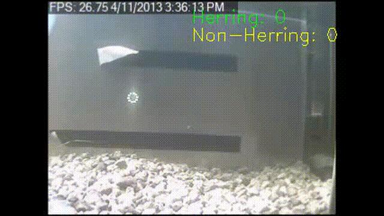
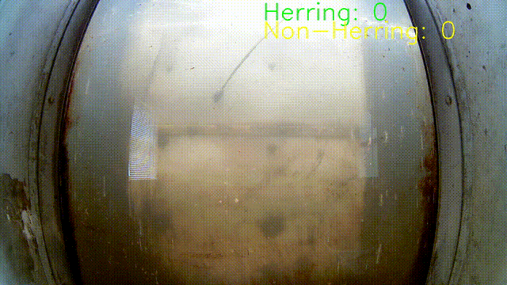

# 🐟 Automated Real-Time Video Monitoring of Fish

Fish monitoring using YOLO11 Object Detection model + BotSort Tracking technique + Customized Counting algorithm

---

## 📌 Overview

- This Project focuses on river herring detection, all other type of fishes are considered as non-herring class.
- The main contribution includes:
    - The curated high-quality balanced training dataset (12,000 images)
    - The trained YOLO11 Object Detection Model weights on our dataset
    - The customized counting algorithm leveraging accumulated fish detections of 70% of the frames.

---

## 🎬 River Herring Counting Demo
<div style="display:flex;justify-content:space-between;">
  
  
</div>


## ⚙️ Installation

### Clone the repository
```bash
git clone https://github.com/Sea-queue/Fish-detection-and-counting.git.git 
```

### Run the model
```bash
from ultralytics import YOLO

# Load a model with our trained weights
model = YOLO("path_to_the_weights")  # load a custom model
```

---

## Testing & Evaluation

The project includes an evaluation framework that benchmarks three counting algorithms (original, zone-based, and stitch/ReID) across multiple test datasets.

For detailed testing instructions, dataset descriptions, CLI options, HPC setup, and diagnostic output — see **[test_scripts/TESTING.md](test_scripts/TESTING.md)**.

Quick start:
```bash
# Run all 3 counting algorithms on all test videos
python eval.py count \
    -d count5 nemasket_normal nemasket_huge nemasket_extra_huge non_herring_easy \
    -w model/train113_weights.pt \
    --algorithm all \
    --no-display \
    --device cuda
```

